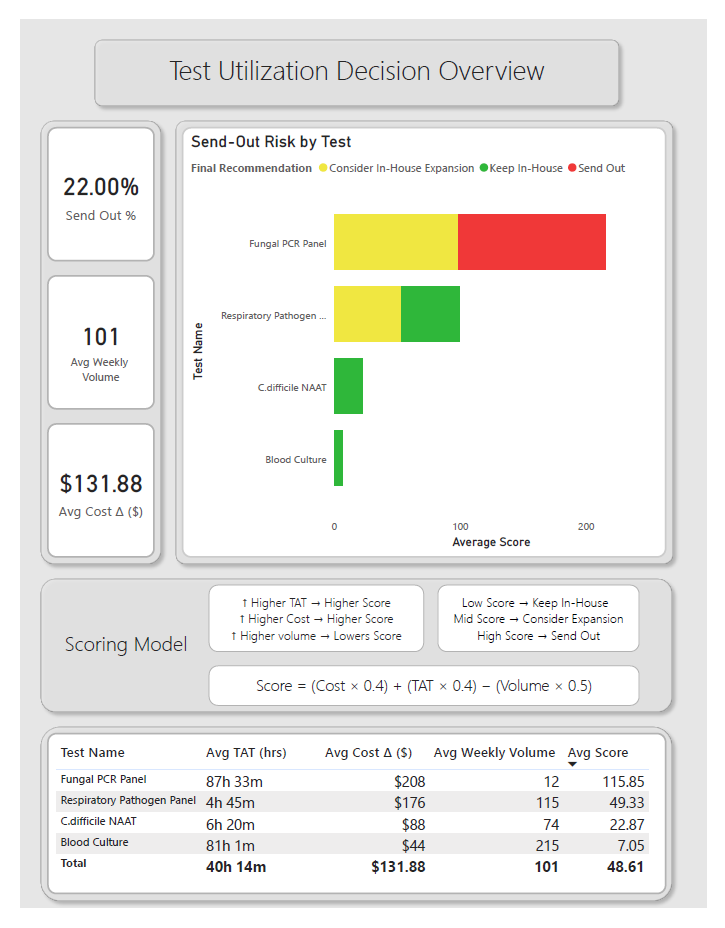
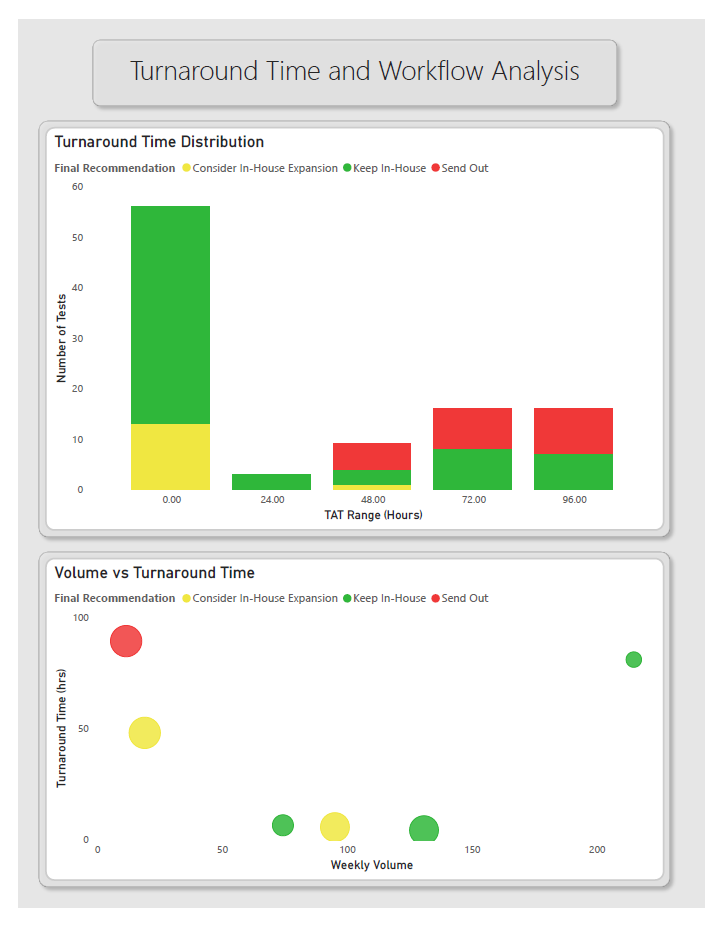

# Lab Utilization Optimization Model

## Overview

A data-driven model for optimizing in-house vs send-out laboratory testing decisions using Python and Power BI.

This project simulates laboratory workflows and applies a weighted scoring model based on turnaround time (TAT), cost, and test volume to support operational decision-making.

---

## Key Features

- Synthetic lab dataset generation using Python
- Feature engineering for cost, volume, and TAT
- Weighted scoring model for utilization decisions
- Power BI dashboard for visualization and analysis

---

## Scoring Model

Score = (Cost × 0.4) + (TAT × 0.4) − (Volume × 0.5)

- Higher cost → increases send-out likelihood  
- Higher TAT → increases send-out likelihood  
- Higher volume → favors in-house processing  

---

## Dashboard Overview

---

## TAT & Workflow Analysis

---

## Key Insights

- Low-volume, high-TAT tests are strong candidates for send-out  
- High-volume tests with low TAT are better suited for in-house processing  
- Cost differences amplify decision impact when combined with operational constraints  

---

## Tools Used

- Python (pandas, numpy)
- Power BI
- Jupyter Notebook

---

## Repository Contents

- `lab_utilization_model_clean.ipynb` — data generation and modeling  
- `lab_utilization_model_clean.csv` — dataset used for dashboarding  
- `images/` — dashboard screenshots  

---
---

## ⚠️ Disclaimer

This project uses simulated data and a fictional healthcare organization for demonstration purposes only.

---

## 👤 Author

**Stephen Henderson**  
Medical Laboratory Scientist (MLS)  
Interested in Epic Beaker, LIS Systems, and Clinical Data Analytics  
